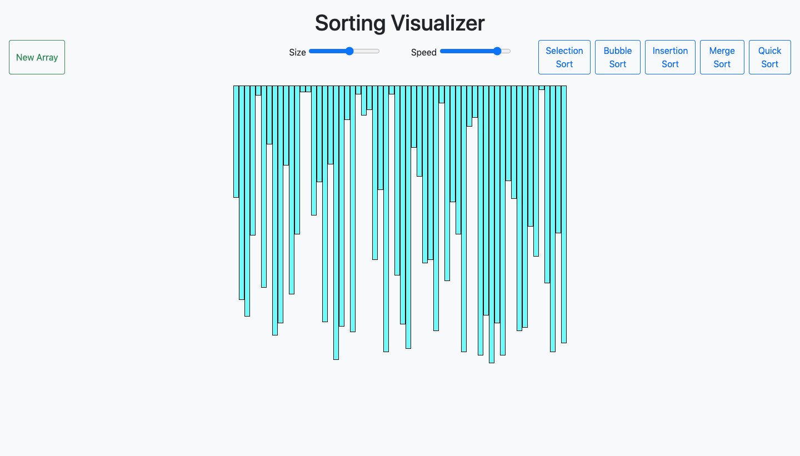
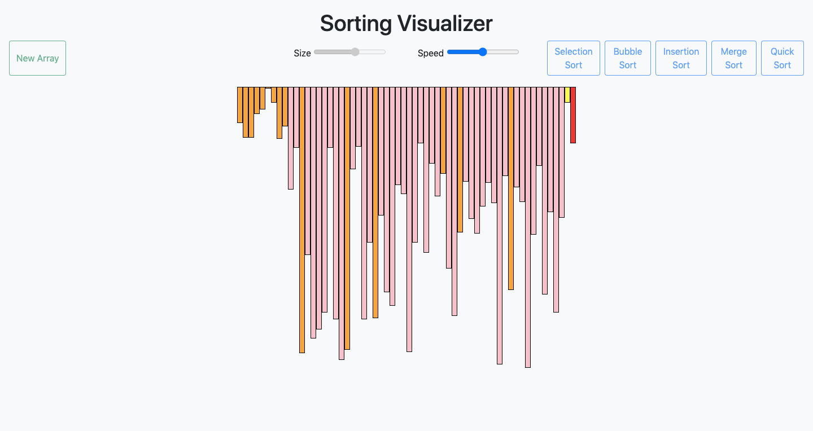
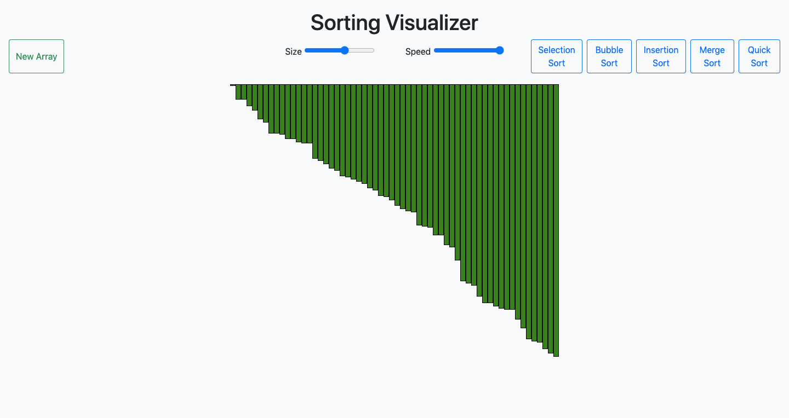

# Sorting Visualizer

## Welcome! 👋

Thanks for checking out this repository.
This is a sorting visualization project.

## Table of contents

- [Overview](#overview)
  - [The challenge](#the-challenge)
  - [Screenshot](#screenshot)
  - [Links](#links)
- [My process](#my-process)
  - [Built with](#built-with)
  - [Useful resources](#useful-resources)

## Overview

### The challenge

- Implement the sorting algorithms in Javascript.
- Selecting items from DOM
- Adding eventlistners
- Visually showing the running of sorting algorithm using async() & await()

### Screenshot

### Links

- Live Site URL: [Live site URL](https://utkarshgoel22.github.io/Sorting-Visualizer/)

## My process

### Built with

- Semantic HTML5 markup
- CSS custom properties
- Bootstrap
- Javascript

### Useful resources

- [MDN](https://developer.mozilla.org/en-US/) - Best resource for HTML5 and CSS3.
- [Javascript(Hindi)](https://www.youtube.com/playlist?list=PLu0W_9lII9ajyk081To1Cbt2eI5913SsL) - For learning Javascript.
- [Javascript(English)](https://www.youtube.com/watch?v=PoRJizFvM7s) - For learning callbacks, Promises, Async, Await.